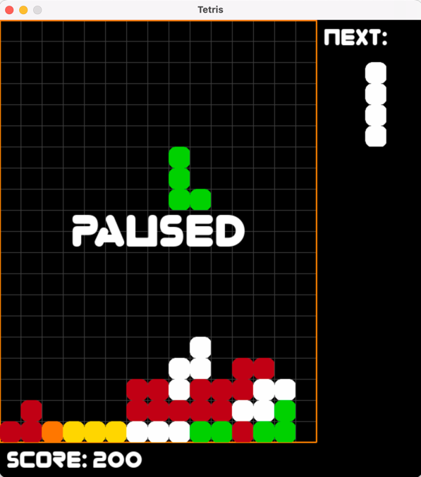

# TETRIS
Autor: Jaroslav Fikar

Email: fikarja3@fit.cvut.cz

## Popis 
Tato aplikace je klonem známé hry tetris. Obsahuje další funkce jako uživatelské menu, ukládání nejvyššího skore a je postavena na přívětivém uživatelském rozhraní.

## Spuštění
    0. Je možné použít připravené prostředí pro condu v souboru `environment.yaml`. Prostředí lze nainstalovat pomocí `conda env create -f environment.yaml`.
    Prostředí má název `fikarja3_tetris`. Prostředí spustíme příkazem `conda activate fikarja3_tetris`; 
    1. Instalace požadavků ze souboru `requirements.txt` pomocí `pip install -r requirements.txt`;
    2. Spuštění hlavního skriptu hry pomocí příkazu `python main.py`;
    
## Návod
    - Po spuštění hry se zobrazí hlavní menu. Hra se spustí pomocí "Play";
    - Hra se ovládá pomocí šipek (NAHORU - rotace tvaru, DOLU - zrychlení pohybu, VLEVO - pohyb vlevo, VPRAVO - pohyb vpravo), 
    pauza pomocí ESC;
    - Ze hry je možno odejít zavřením okna hry;
    - Pro úplný odchod z aplikace pak slouží možnost "Quit" v hlavním menu.
    